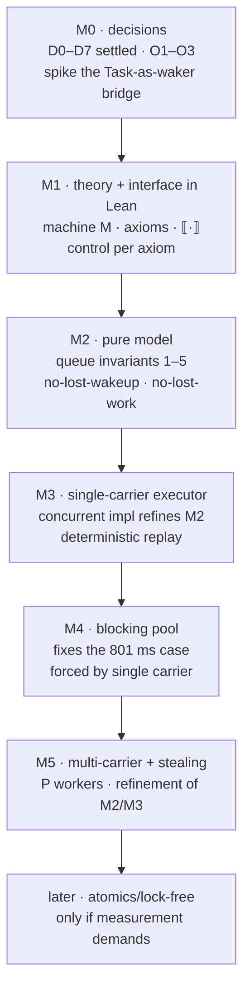

# `leanin` — plan and roadmap

A concurrency library and scheduler for **Lean 4**, with the scheduling policy written in Lean, the
algorithms taken from Tokio, and machine-checked proofs for the properties that matter.

| Document | Contents |
|---|---|
| [`docs/decisions.md`](docs/decisions.md) | **D0–D7 settled, O1–O3 open.** Read this first |
| [`docs/primitive-theory.md`](docs/primitive-theory.md) | What the externs guarantee: axioms, discharge, control tests |
| [`docs/interface.md`](docs/interface.md) | The fixed interface: one spec, two implementations |
| [`docs/lean-scheduler.md`](docs/lean-scheduler.md) | What scheduler Lean actually uses today, from the C++ runtime |
| [`docs/tokio-map.md`](docs/tokio-map.md) | What we take from Tokio, component by component |
| [`docs/proof-strategy.md`](docs/proof-strategy.md) | Property ladder, TCB, the hard parts |
| [`docs/reading-list.md`](docs/reading-list.md) | Annotated primary sources with verification status |
| [`docs/evidence.md`](docs/evidence.md) | Every measured and read-first-hand fact, with anchors |

---

## 0. Status

**M0 is complete.** D0–D10 in [`docs/decisions.md`](docs/decisions.md) are all closed — including the
`Task`-as-waker bridge, which was the last unverified assumption and is now spiked with a passing
observation ([`evidence.md`](evidence.md) §5). The interface in
[`docs/interface.md`](docs/interface.md) is therefore freezable, and M1 can start.

No library code exists yet, by design: the plan is model-first, and the model is M2.

Two findings did the shaping, and both were surprises:

1. **The scheduler is a global singleton with no injection point.** `static task_manager *
   g_task_manager` (`object.cpp:1095`), constructed at startup, no handle, no second instance. So
   there is no runtime object to replace: a scheduler is a fork, a parallel runtime, or an
   `@[extern]`-and-own-library arrangement. We chose the third (D0).
2. **`Std.Async` is not a runtime.** It is `BaseIO (MaybeTask α)` and every operation delegates to
   `Task` (`Basic.lean:327,389,432,456,463,474`) — no queue, no waker, no poll. Driving it *is* using
   the stock pool. So the task layer is ours by elimination (D3), while the leaf layer (timers,
   sockets, `Std.Sync`) is reused.

---

## 1. What we are building

Four things, and deliberately no more:

1. **A task layer** — our own `Task`/`Async`, continuation-based, because `Std.Async` cannot be reused
   and `Task` cannot be patched (D3).
2. **A scheduling policy** — a single-carrier executor first (D2), with the multi-carrier
   work-stealing scheduler as a *refinement* of it rather than a first build.
3. **A blocking pool** — forced early, because with one carrier a blocking task blocks everything.
4. **A theory of the primitives** — the axioms that make the rest provable
   ([`primitive-theory.md`](primitive-theory.md)).

If the project ever reads as "reimplement Tokio", scope has escaped. Lean already has the async
surface, the sync primitives, libuv I/O and an HTTP server; what it lacks is exactly the four items
above.

---

## 2. What the current scheduler does, and why we are replacing the policy

Measured on this machine, 8 cores ([`evidence.md`](evidence.md)):

| Probe | Result | Reading |
|---|---|---|
| 64 tasks @ default priority | 7–8 threads | pool capped at core count |
| 64 × `IO.sleep 100` | **801 ms** | `ceil(64/8)×100`: blocking occupies a worker |
| 64 × `Async.sleep 100` | **102 ms** | libuv timers cost no worker |
| same, at `LEAN_NUM_THREADS=1` | 6406 ms / 102 ms | one blocked worker per task; reactor independent |

The policy we are replacing: nine shared FIFO deques behind **one** mutex, strict priority, no
stealing, no fairness, and `IO.sleep` implemented through `lean_dbg_sleep` — a debug helper whose
Lean definition ignores its argument ([`lean-scheduler.md`](lean-scheduler.md) §7).

---

## 3. Strategy

**Prove the parts. Test the seams. Fix the interface first.**

- **Model first for the core, running code for the surface.** The pure model is executable, so it is
  testable the day it compiles, and every property is stated against it.
- **The axioms enter the proof in one place** — a serializability lemma — so they do not thread
  through every argument ([`primitive-theory.md`](primitive-theory.md) §4).
- **Test where proof cannot yet reach, and say so.** Lean has no ThreadSanitizer and no deterministic
  scheduler hook, so until the single-carrier executor exists, concurrent code is validated by stress
  under varied `LEAN_NUM_THREADS` and priorities. After it exists, failures are replayable.
- **Invert Tokio where the substrate differs.** Batch-stealing amortises a CAS and never blocks the
  victim; under a lock it lengthens the critical section and blocks the victim. So we steal one
  element, and copy the rest of the shape unchanged.

---

## 4. Workspace and toolchain

- Toolchain pinned in two places that must agree: `lean-toolchain`
  (`leanprover/lean4:v4.35.0-rc3`, for elan) and `flake.nix` (`leanDistribution`, the same release
  tarball by SHA-256, for nix) — because `Std.WP` exists only in the 4.35 line. The nix pin exists
  because elan resolves `lean-toolchain` over the network, which offline runs cannot do; the pattern
  is copied from `../SpecAMQP`/`../TemperMint`.
- Build: `nix develop -c lake build`; harness: `nix develop -c lake exe spike`. The dev shell wraps
  `lake`/`lean` in `nice -n 19`; `LEANIN_LEAN_NICE=0` opts out.
- Reference trees, read-only and outside the build: `Vendor/tokio/` (algorithms) and `Vendor/lean4/`
  (the runtime, at the exact toolchain commit).
- No Lake dependencies yet — `Std` ships with the toolchain. `iris-lean`, if used, arrives as a pinned
  flake input materialised into an offline workspace, as `SpecAMQP` does for mathlib.

```
LeanIn/
  Model/      Queue.lean  Scheduler.lean     -- pure, executable, the spec
  Theory/     Machine.lean  Axioms.lean      -- M and ⟦·⟧, the primitive theory
  Sched/      Inject.lean  Worker.lean  Park.lean
  Runtime/    Executor.lean  Blocking.lean
  Task/       Task.lean  Async.lean          -- our task layer, MonadAsync/MonadAwait
  Test/       Control.lean                   -- one control per axiom
Vendor/{tokio,lean4}/
docs/
```

---

## 5. Roadmap



Critical path to something usable: **M1 → M2 → M3**. M4 is forced by D2 and is small.

---

### M0 — Close the open questions

**Goal:** make the interface freezable.

**Build**
- ~~Copy Tokio~~ — **done**: `Vendor/tokio` at `3eb95a40…`, `master`, 2026-10-07.
- ~~Pin the runtime source~~ — **done**: `Vendor/lean4` at `v4.35.0-rc3`, commit `470d5ce…`, the exact
  toolchain commit.
- ~~Pin the environment~~ — **done**: `flake.nix` + `flake.lock`.
- **Spike O3**: attach a continuation to a `Task` that pushes into a `LeanIn` inject queue and
  notifies; show a task body never executes on the stock pool. This is the one unverified design
  assumption.

**Decide** — ~~O1~~ → **D8**, ~~O2~~ → **D9**, ~~O3~~ → **D10**, all closed in
[`decisions.md`](decisions.md).

**Exit criteria — met**
- D8 and D9 recorded with their reasons; **D10 spiked with a passing observation**
  (`WakerSpike.lean`, three runs, all checks true).
- `nix develop -c lake exe spike` reproduces the baseline in [`evidence.md`](evidence.md).

---

### M1 — The theory and the interface, in Lean

**Goal:** the axioms exist as Lean declarations, and the interface is frozen against them.

**Landed so far.** The machine, its theorems, and the bridge:
- `LeanIn/Theory/World.lean` — `World`, `Act`, `step`/`Step`, and proofs of mutual exclusion
  (`lock_has_one_owner`, `lock_gives_ownership`), A3's impossibility
  (`unlock_without_ownership_has_no_transition`), A5's loss of notification
  (`notifyOne_no_waiters`, with affirmative controls), A4's `spurious_wakeup_permitted`, and no
  fairness (`both_orders_permitted`, `reacquisition_while_others_wait`). Plus vacuity checks showing
  every hypothesis is inhabited and every predicate distinguishes. **No sorries.**
- `LeanIn/Theory/Bridge.lean` — the seven axioms, each with its citation, plus the `#print axioms`
  audit, which reports that the model's theorems depend only on `propext` and `Quot.sound`.
- `LeanIn/Test/Control.lean` — the runtime controls, one per testable axiom (A1, A2, A4, A5, A7), with
  their observations in [`evidence.md`](docs/evidence.md) §6. A3 and A4 are documented as *not*
  testable rather than skipped quietly.

**Still to do** — the interface signatures, and the refinement obligation stated against them.

**Build** — `LeanIn/Theory/`, then `docs/interface.md` realised as Lean signatures
- the machine `M`: engine state, locks, condvar waiter sets, clock;
- `⟦·⟧` for the primitive fragment;
- A1–A7 as Lean axioms, each carrying its source citation in a doc-comment;
- one **control** per axiom in `LeanIn/Test/Control.lean` — a test that would fail if the axiom were
  false, because a marker that never fires passes forever;
- the interface signatures from [`interface.md`](interface.md), both pure and `IO`, with the
  refinement obligation stated (not yet discharged).

**Test** — the controls, run as an executable. Each is an affirmative control for the corresponding
axiom, not a smoke test.

**Exit criteria** — the axiom set compiles, is the size of the list in D7 (no accidental extras), and
every axiom has a control that has been observed to distinguish "holds" from "does not hold".

---

### M2 — The pure model

**Goal:** a scheduler as mathematics, with no concurrency at all, and executable.

**Build** — `LeanIn/Model/`
- `Queue α := List α` with `push`/`pop`/`steal` per [`interface.md`](interface.md) §2;
- the worker shape: bounded ring, one-slot LIFO, `lifoPolls` capped at 3, overflow to inject;
- `Scheduler`: workers, inject, idle set, `stopping`.

**Landed so far** — `LeanIn/Model/Pool.lean`, the worker shape:
- `Pool` with the ring, LIFO slot, per-tick allowance, inject queue, and the `pushed`/`taken`
  bookkeeping Tokio lacks. **No sorries.**
- **`Consistent`** — no lost work, as an equation: `inFlight + taken = pushed`. Preserved by
  `submit`, `take`, `steal` and `tick`; Tokio asserts this at runtime (`queue.rs:571`).
- **`take_returns_if_present`** — `take` never reports nothing while work is present. This is the
  theorem the LIFO *flush* exists for: without it the per-tick allowance could strand work while
  `Consistent` still held.
- **`submit_bounded`** — the ring stays within capacity through overflow.
- Vacuity checks for every predicate, including the control that work held *only* in the LIFO slot is
  genuinely not stealable while the owner can still reach it.
- **The audit**: `#print axioms` on four of these reports only `propext` and `Quot.sound` — none of
  the bridge axioms. The model is not circular; it does not assume the primitives it is about.

**Landed** — `LeanIn/Model/Scheduler.lean`, the wake protocol:
- `Sched` (work, parked, total, stopping) and `Sched.Live`: work implies a worker that is not parked.
  `Reachable` restricts the claim to states the protocol can produce, because a state with work and
  every worker parked *is* well-formed and *would* be a lost wakeup — so `Live` is genuinely stronger
  than `WF`, and the control shows it.
- **`reachable_live`** — no lost wakeup, from every reachable state.
- The unpark in `enqueue` is **load-bearing, not decorative**: `enqueueWithoutWaking_breaks_live`
  exhibits a well-formed, `Live` state that a plausible enqueue destroys. That is A5 in protocol form —
  the notification has no memory, so the unpark cannot be deferred to a separate step.
- `park` has no transition unless `work = 0`: the check is structural, not advisory, and the controls
  show both directions so the refusal is not vacuous.
- Audit: `reachable_live` depends on `propext`, `Classical.choice` and `Quot.sound` only. No bridge
  axiom; `Classical.choice` is from `by_cases`, a Lean built-in.

**Still to do** — invariants 2–4 over the pool as a whole: well-defined reads, uniqueness, existence.

**Prove**
- queue invariants 1–5 (no lost work, well-defined reads, uniqueness, existence, bounded capacity);
- **no lost wakeup**: if work exists and a worker is parked, one is woken;
- **no lost work at shutdown**: draining returns every queued element;
- **bounded work per tick**: the coop budget and the LIFO cap do what they claim.

**Test** — the model is executable, so: `#eval` on small schedules, enumerated interleavings,
property tests over generated schedules. **A vacuity check on every predicate**: `parked`/`idle` must
be inhabited by some reachable state and not by others, so the theorems are not vacuous.

**Exit criteria** — sorry-free; a corpus of generated schedules runs and the invariants hold; the
`steal`-order property is demonstrated by a failing control on a deliberately mis-ordered variant.

---

### M2b — The ring buffer container (D12)

**Goal:** the container the spec describes, and the laws tying it to the spec.

`Pool.ring : List α` is the ghost view, not an implementation. The container is a fixed store plus the
index of the oldest live element plus a live count.

**Build** — `LeanIn/Data/Ring.lean`
- `Ring` with `slots`, `head`, `size`;
- `Ring.toList` — the ghost view, oldest first, so every downstream proof is about a list;
- `Ring.WF` — the store's length is `cap`, the live count fits, **and the live range is dense** (no
  holes), so `toList` yields real elements rather than defaults;
- `push` / `pop`.

**Prove**
- `push_toList` and `pop_toList` — the laws that make `Ring` an implementation of the spec's queue;
- the one lemma where the arithmetic lives: distinct live indices occupy distinct slots. Everything
  modular is isolated there, and no proof downstream of the ghost view ever sees an index.

**Why before M3:** the concurrent queue is a `Ring` under a mutex. This is the implementation's core,
and it is pure, so it is provable now rather than under a lock.

**Precedent:** `Std.DHashMap` — an Array implementation carrying a bundled well-formedness invariant,
proved against a `List` model in `Std/Data/DHashMap/Lemmas.lean`. Array container, list ghost view,
laws in their own file.

**Landed** — `LeanIn/Data/Ring.lean`. The container, with every law proved:

- `Ring` (fixed store, head index, live count), `Ring.toList` (the ghost view), `Ring.WF` (with the
  `join`-guarded density conjunct), `push`, `pop`;
- **`slot_ne`** — distinct live indices occupy distinct slots. Everything modular is here;
- **`push_toList`**, **`pop_toList`** — the laws tying the container to the spec;
- **`push_wf`**, **`pop_wf`** — the invariant is preserved, without which the laws would be one-shot;
- **`pop_isSome`** — density does work: a non-empty ring can always be popped.

Audit: all five depend only on `propext` and `Quot.sound`.

**How the arithmetic is done — the finding that mattered.** `omega` handles `%` only after it is
*eliminated*, so `slot_ne` normalises with `Nat.mod_add_mod` and then splits on whether each argument is
below or above `cap`. The step that took the longest to find: that split must carry its **side
condition** out with it. `Nat` subtraction saturates, so a bare `m % cap = m - cap` is *satisfiable* at
`m = cap = 0` and refutes nothing — the `cap ≤ m` that `key` now returns alongside it is what makes the
equation contradicted. A second, quieter trap: `hw : r.WF` is opaque to `omega`, so `hw.2.1` has to be
extracted into a local before any bound on `r.size` is visible.

**Vacuity checks are in — and they earned their keep.** Three checks: `emptyRing Nat 4` is
well-formed; a ring whose live count exceeds its capacity is *not*, so `WF` distinguishes rather than
holding of everything; and a push followed by a pop can always proceed.

The first one **found a real defect**. `emptyRing` was defined with `slots := []`, but `WF` requires
`slots.length = cap` — so `emptyRing Nat 4` was never well-formed and every law instantiating it was
about nothing. It is now `List.replicate cap none`. A gap I nearly left as "outstanding" turned out to
be hiding a bug in the very definition the checks existed to validate.

Getting the checks to typecheck also needed a technique worth recording: **use defeq coercion, not
`simp`**. `(emptyRing Nat 4).size` reduces to `0` definitionally but is not a `simp` target, so
`have : i < 0 := hi` works where `simp [emptyRing] at hi` leaves a goal behind.

**Exit criteria** — the laws hold, the checks distinguish, and the ghost view is the only representation
any downstream proof mentions.

---

### M3 — The single-carrier executor

**Goal:** the first thing a user can run — and the deterministic runtime falls out of it.

**Build** — `LeanIn/Sched/`, `LeanIn/Runtime/`, `LeanIn/Task/`
- the worker loop over the model's structure, backed by `Mutex`/`Condvar`;
- the inject queue and the park protocol;
- our `Task`/`Async` with `MonadAsync`/`MonadAwait` instances;
- the bridge from `Task`-as-waker into `inject` (M0's spike, promoted);
- `blockOn`: drive the executor on the caller's thread.

**Prove** — refinement of M2 (`Impl.push ⊑ Model.push`, etc.), using the serializability lemma.

**Test**
- run real work; confirm the executor uses **one** thread and no pool workers;
- **deterministic replay**: same seed, same trace, byte-for-byte; a failure replays from its seed.
- the A5 control in situ: a park/wake protocol that survives a lost notification because state is
  checked under the lock.

**Exit criteria** — the executor runs; refinement obligations discharged for the operations in
[`interface.md`](interface.md) §6; replay is deterministic; and Lean now has something it did not have
before, which is a scheduler whose behaviour is *specified*.

---

### M4 — The blocking pool

**Goal:** stop blocking work from stopping everything — blocking **I/O and CPU**, not just `IO.sleep`
(D11).

**Why here.** D2 forces it: with one carrier, `IO.sleep` on the executor blocks the executor. This is
the 801 ms pathology from [`evidence.md`](evidence.md), and under a single carrier it is *worse* than
under the stock pool, which at least has 8 workers. It is also the only place `leanin` gets I/O
concurrency: polling stays single-threaded (D11), and for files a thread is the only option.

**Build** — `LeanIn/Runtime/Blocking.lean`: a bounded pool of carrier threads, off the executor's
queue, with its own queue and its own shutdown. Threads come from `Task.Priority.dedicated`, so no new
primitive and no A6.

**Test** — the two measured cases, as regression guards: `N` blocking jobs must not stall the
executor, and the stock pool must be left untouched.

**Exit criteria** — the 801 ms case no longer applies to `leanin` work; blocking work is accounted for
and cannot starve the executor.

---

### M5 — Multi-carrier and stealing

**Goal:** the Tokio-shaped scheduler, as a refinement of M3 rather than a new design.

**Build** — per-worker rings behind their own `Mutex`, the inject queue, the idle set, park/unpark
across threads, the steal protocol with batch size **one** (D4).

**Prove**
- refinement of the M2 model, now with real interleaving;
- no lost wakeup across threads;
- **completion, conditional on a fairness hypothesis** — A1 gives no fairness and A6 gives no
  scheduling guarantee, so the hypothesis belongs in the statement (D-absences,
  [`primitive-theory.md`](primitive-theory.md) §3).

**Test** — the contention case; scale to ≥ 10⁵ tasks; a drain test with all workers parked.

**Exit criteria** — work stealing beats or matches the stock pool on the async benchmark while
preserving every M2 invariant.

---

### Later, and only on evidence

- **Atomics / lock-free queues** — a new extern family plus weak-memory reasoning `iris-lean` cannot
  do. Only if M5's measurement demands it.
- **The randomized bound** (Blumofe–Leiserson) — needs balls-and-bins concentration that Mathlib
  lacks. Off the critical path and independently publishable.
- **Ergonomics** (`select!`-style macros, `JoinSet`) — policy, tested not proved.

---

## 6. Risk register

| Risk | Impact | Mitigation |
|---|---|---|
| O2 (`Send` replacement) stays open | the interface cannot freeze; a racing `spawn` is unsound | close it in M0; the leaning is a marker type now, a restricted-subset theorem later |
| The `Task`-as-waker bridge (O3) does not work | M3's external-event path needs redesign | **spiked in M0**, before anything depends on it |
| No semantics for `IO`/`Task` (the original Gap A) | proofs are about a model, not the running Lean term | that is what [`primitive-theory.md`](primitive-theory.md) is for; the TCB is stated, not hidden |
| The TCB grows silently as shortcuts are taken | the claim weakens without anyone noticing | D7's list is closed and checked against the externs the artifact actually reaches |
| `iris-lean` is SC-only | no weak-memory reasoning | D4 (lock-per-queue) means we do not need any; D6 states it |
| Even verified kernels assume scheduler fairness | a fairness claim would be novel, not routine | state fairness as a hypothesis; P9 off the critical path |
| Single carrier does not fix blocking, and makes it worse | M4 is forced, not optional | M4 is small and scheduled immediately after M3 |
| Scope creep into "reimplementing Tokio" | unbounded | §1's four items; everything else named out of scope |
| `iris-lean` does not build on 4.35.0-rc3 | Rocq fallback needed for v2 proofs | verify in M1; `~/.opam/rocq-9` has `coq-iris 4.4.0` and `rocq-iris dev 2026-06-04` |

---

## 7. Open decisions

None. All of D0–D10 are closed in [`docs/decisions.md`](decisions.md).

**D9 is the one to revisit** — a marker type stands in for `Send`, which is sound only if users
respect it. The better end state is a *proved* non-interference property for a restricted subset of
the API, and that is worth reconsidering once the interface has seen real use.

## 8. What "done" looks like

- A single-carrier executor runs real Lean programs deterministically, and its correctness is a
  refinement of an executable model.
- The primitives it stands on are named in one file, each with a citation and a control.
- A work-stealing multi-carrier scheduler refines the same model, with completion stated against an
  explicit fairness hypothesis.
- Every failure is replayable from a seed.
- Nothing in the TCB is unstated, and nothing in the interface promises a guarantee the primitives do
  not give.
